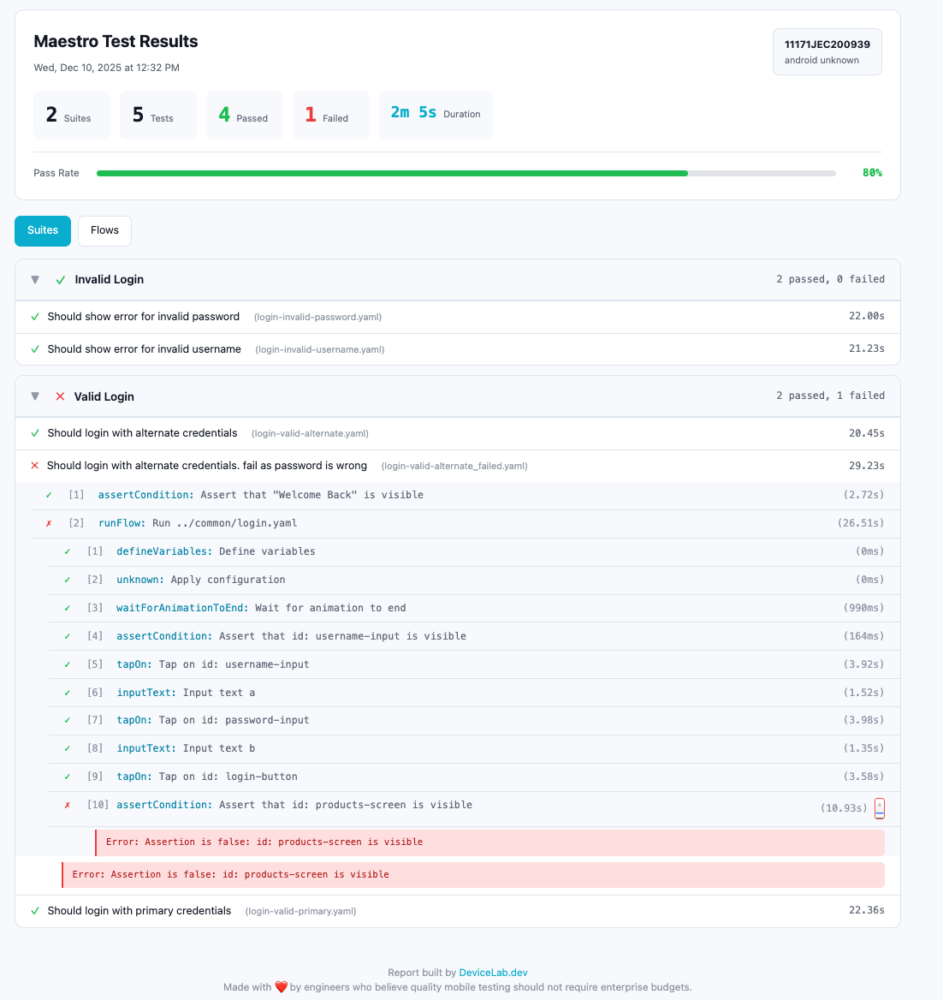

# Maestro Complete Reports

> **Community Build** - Not affiliated with Maestro or mobile.dev
>
> Enhanced reporting by [DeviceLab.dev](https://devicelab.dev) - Turn Your Devices Into a Distributed Device Lab

---

Patch Maestro with enhanced reporting features including JSON, HTML, JUnit XML, and Allure report formats.

## Supported Versions

- Maestro 2.0.9
- Maestro 2.0.10

## Quick Start

### Option 1: Using the Binary (Automated)

```bash
# Setup - detects Maestro, backs up JARs, downloads and replaces with patched JARs
./maestro-complete-reports setup

# Restore original JARs
./maestro-complete-reports restore
```

### Option 2: Manual Installation

```bash
# Copy JARs to Maestro lib directory
cp jars/2.0.10/*.jar ~/.maestro/lib/

# To restore
cp ~/.maestro/backup/*.jar ~/.maestro/lib/
```

## Usage

```bash
# Basic - generates reports in ./reports/
maestro test flows/

# CI/CD optimized - flat output
maestro test flows/ \
  --report-dir ./ci-reports \
  --flatten-report-output
```

## Try It Yourself

```bash
# Install sample app
adb install samples/apk/TestHive.apk

# Run sample tests
maestro test samples/flows/auth-suite.yaml
```

## Sample Reports

| Format | Sample |
|--------|--------|
| JSON | [report.json](samples/report.json) |
| JUnit XML | [junit-report.xml](samples/junit-report.xml) |
| Sample Flows | [samples/flows/](samples/flows/) |

### HTML Report



<details>
<summary>Console Output</summary>

```
===== Test Summary =====

✅ Invalid Login
  ✅ Should show error for invalid password
  ✅ Should show error for invalid username
❌ Valid Login
  ✅ Should login with alternate credentials
  ❌ Should login with alternate credentials. fail as password is wrong
  ✅ Should login with primary credentials

========================
Suites: 1 passed, 1 failed
Tests:  4 passed, 1 failed

  4/5 Flows Passed

==========================================================================================
  Flow                                   Status  Steps   Pass   Fail   Skip   Duration
------------------------------------------------------------------------------------------
  Login - Invalid Password                    ✓     10     10      0      0      23.0s
  Login - Valid Alternate Credentials         ✓     13     13      0      0      22.0s
  Login - Valid Alternate Credentials         ✕     11     10      1      0      30.0s
  Login - Valid Primary Credentials           ✓     13     13      0      0      23.0s
  Login - Invalid Username                    ✓     10     10      0      0      22.0s
------------------------------------------------------------------------------------------
  Total                                             57     56      1      0      2m 0s
==========================================================================================
```

</details>

## Documentation

- [CLI Options](docs/cli-options.md) - All report configuration options
- [Test Suites](docs/test-suites.md) - Organizing tests with suite/test commands
- [CI/CD Integration](docs/ci-cd.md) - GitHub, GitLab, Jenkins, CircleCI examples
- [Analyzing Reports](docs/analyzing-reports.md) - jq queries, Allure, report schemas

## Backup Location

Original JARs are backed up to `~/.maestro/backup/`

---

## Contributing

Issues and PRs welcome at [GitHub](https://github.com/devicelab-dev/maestro-complete-reports).

## License

Apache 2.0 (same as Maestro)

## Disclaimer

This project is not affiliated with, endorsed by, or connected to mobile.dev or the official Maestro project.

This tool patches your existing Maestro installation to add reporting functionality not yet available in the official release.

Use at your own risk. We recommend switching to official Maestro once these reporting features are officially released.
